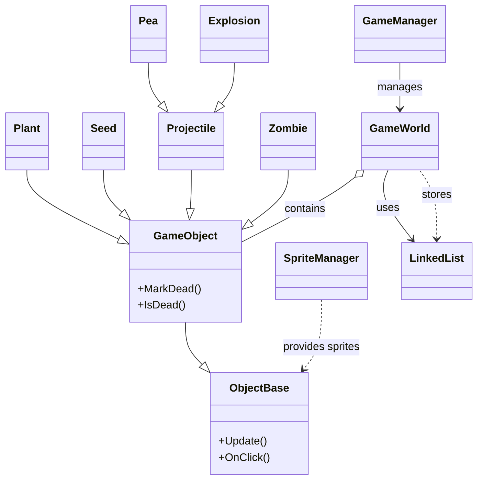

可选扩展（非交互）:

- 将每个类的 API 手册进一步扩展为更详尽的逐函数注释（列出每个成员函数的参数、返回值、副作用与示例调用），以便评分或教学使用。
- 生成更详细的 mermaid 类图或交互序列图，并将渲染结果（SVG/PNG）纳入文档以便离线阅览。
- 若需分离文档，可将本 README 保存为 `proj1/FULL_DOCUMENTATION.md` 并在仓库中增加 `proj1/assets/docs/` 用于存放渲染后的图像或示例代码片段。

### WorldBase / GameWorld（`include/pvz/Framework/WorldBase.hpp`、`include/pvz/GameWorld/GameWorld.hpp`）

- GameWorld::Init()：初始化关卡（生成背景、种植点、种子按钮、铲子、文本显示等）。
- GameWorld::Update()：每 tick 调度入口（更新对象、生成阳光/僵尸、处理碰撞、清理死亡、更新 UI 文本、返回 LevelStatus）。
- 对象管理：Add(shared_ptr<GameObject>)、Remove(shared_ptr<GameObject>)，容器为自定义 `pvz::LinkedList<std::shared_ptr<GameObject>> mlist`。

# PvZ 项目（植物大战僵尸）

本仓库为 CS101A 项目 1 的一个 C++/OpenGL 实现（PvZ 风格）。
实现基于 C++17 + CMake + FreeGLUT + SOIL，采用 tick（刻）为单位的游戏循环。

## 目录（概要）

- 项目概述与目标
- 快速运行
- 代码组织
- 关键类与 API 手册
- 游戏机制与数值（重要常量）
- 已实现特性与扩展
- 已知问题与注意事项
- 测试建议与复现用例
- 后续改进建议

---

## 项目概述与目标

该项目实现了一个简化的 "植物大战僵尸" （PvZ）克隆：

- 支持向日葵生成阳光与天空随机掉落阳光；
- 支持种子按钮、冷却遮罩、种植位（隐形的兔子模式）；
- 支持豌豆射手、双发射手、坚果墙、樱桃炸弹、撑杆跳僵尸等对象；
- 实现投射物-僵尸碰撞、僵尸啃食植物逻辑、僵尸波次调度；
- 采用自定义双向链表替代 STL list（作业要求），并广泛使用智能指针管理生命周期。

目标：满足课程给出的基础功能与若干扩展要求，且代码风格尽量符合评分细则。

---

## 关键类与 API 手册（逐类详尽）

下面逐类列出本项目中重要类的函数签名、行为说明与使用示例，方便查阅与扩展。类定义以项目头文件为准，下面列出的签名是项目中实际可用的接口。

注意：示例代码省略错误检查与头文件包含，仅用于演示调用方式。

## 关键类与 API 手册（逐函数注释）

下面把 README 里的 API 部分进一步细化为“逐函数注释”风格：对每个重要类列出成员函数签名、参数说明、返回值、副作用与示例调用。目标是方便助教评分与后续扩展。

注：此处列出的签名与说明基于仓库实现；如需精确头文件行号可在 `include/pvz/` 下查阅对应头文件。

---

### 全局工具与常量（`include/pvz/utils.hpp`）

- int randInt(int min, int max)

  - 说明：返回闭区间 [min, max] 的均匀随机整数。
  - 参数：min（最小值），max（最大值）。
  - 返回：int，位于 [min,max]。
  - 示例：
    ```cpp
    int x = randInt(75, WINDOW_WIDTH - 75);
    ```

- 常量示例：
  - const int WINDOW_WIDTH, WINDOW_HEIGHT, LAWN_GRID_WIDTH, LAWN_GRID_HEIGHT, GAME_ROWS, GAME_COLS

---

### ObjectBase（`include/pvz/Framework/ObjectBase.hpp`）

构造与析构：

- ObjectBase(ImageID imageID, int x, int y, LayerID layer, int width, int height, AnimID animID)
  - 创建可渲染对象并注册到框架的渲染/碰撞系统。

成员函数（逐函数注释）：

- virtual void Update()

  - 说明：每 tick 被调用以更新对象内部状态。子类需重写。
  - 返回：void。

- virtual void OnClick()

  - 说明：当鼠标点击对象时调用，子类实现交互逻辑（例如植物被铲除或种子被选中）。

- int GetX() const / int GetY() const

  - 返回对象当前屏幕坐标。

- int GetWidth() const / int GetHeight() const

  - 返回对象的渲染尺寸（像素）。

- void MoveTo(int x, int y)

  - 说明：设置对象的位置（直接赋值、无平滑）。
  - 副作用：改变 GetX()/GetY() 的返回值。

- void PlayAnimation(AnimID anim)

  - 说明：切换当前播放动画并从头开始播放。

- void ChangeImage(ImageID imageID)
  - 说明：替换对象所用的静态/精灵表图片（常用于坚果破碎/桶掉落后更换贴图）。

示例：在子类 Update 中移动对象

```cpp
void MyObject::Update() override {
  MoveTo(GetX() + 1, GetY());
}
```

---

### GameObject（`include/pvz/GameObject/GameObject.hpp`）

说明：GameObject 继承自 ObjectBase，增加生命值/死亡标记、以及按类型的虚函数（isPlant/isZombie 等）用于安全识别。

构造：

- GameObject(ImageID imageID, int x, int y, LayerID layer, int width, int height, AnimID animID, int hp)
  - hp：初始生命值（若不适用可设为 0）。

主要成员（逐函数）：

- void MarkDead()

  - 将对象标记为死亡，GameWorld 在下一次清理阶段移除并释放相关资源。

- bool IsDead() const

  - 返回是否已被标记为死亡。

- virtual bool isPlant() const = 0; // 纯虚，派生类实现
- virtual bool isZombie() const = 0;
- virtual bool isProjectile() const = 0;
- virtual Plant\* AsPlant(); // 提供轻量 downcast
  - 说明：若对象为 Plant 子类则返回指针；否则返回 nullptr。目的是避免 dynamic_cast。

示例：标记并延迟清理

```cpp
obj->MarkDead(); // GameWorld::Update 会在清理阶段移除
```

---

### pvz::LinkedList<T>（`include/pvz/Containers/LinkedList.hpp`）

说明：作业要求自实现的双向链表，支持在遍历期间安全删除元素。

主要 API：

- void push_back(const T& value)
- void push_front(const T& value)
- iterator erase(iterator it)
- template<typename Predicate> void remove_if(Predicate pred)
- iterator begin(), end(); size_t size(); bool empty(); void clear();

副作用/性能：remove_if 在 O(n) 时间内遍历并删除符合条件的节点，适用于 GameWorld 清理死亡对象。

示例：

```cpp
mlist.remove_if([](const auto &o){ return o->IsDead(); });
```

---

### GameWorld（`include/pvz/GameWorld/GameWorld.hpp`）

说明：关卡管理器，负责对象容器、生成逻辑（阳光、僵尸）、碰撞分发、UI 文本与总体 tick 流程。

构造/生命周期：

- void Init() override

  - 初始化场景：生成背景、种植位、UI 种子面板、铲子与初始阳光。

- LevelStatus Update() override

  - 每 tick 调用，按顺序：更新所有对象 -> 处理碰撞 -> 生成新对象（天空阳光/僵尸）-> 清理死亡对象 -> 更新文本 UI。
  - 返回：LevelStatus（ONGOING / LOSING 等），GameManager 根据返回值切换状态。

- void CleanUp() override
  - 清空对象容器并释放资源，供回到菜单或重置使用。

对象管理：

- void Add(std::shared_ptr<GameObject> obj)

  - 将对象加入内部 `pvz::LinkedList` 容器并注册层级显示。

- void Remove(std::shared_ptr<GameObject> obj)
  - 立即将对象从容器中移除（慎用，通常使用 MarkDead 并在清理阶段删除）。

阳光与波数：

- int GetSunCount() const
- void ChangeSun(int delta)
- int GetWaveCount() const
- void ChangeWave(int delta = 1)

种子/铲子操作：

- bool IsHoldingSeed() const; void SetHoldingSeed(Seed\* seed); void ClearHoldingSeed();
- bool IsHoldingShovel() const; void ToggleShovel(); void ReleaseShovel();

查询与帮助：

- std::shared_ptr<Plant> GetPlantAt(int gridX, int gridY) const

  - 说明：按格子或坐标返回行内指定位置的植物（若无则返回 nullptr）。

- bool HasPlantAt(int x, int y) const

- bool HasZombieAhead(int laneY, int fromX) const
  - 说明：射手使用，判断在 fromX 右侧是否存在僵尸，常用于避免空射。

示例：在 Update 中生成阳光并添加到世界

```cpp
if (shouldSpawnSkySun) {
  world->Add(std::make_shared<Sun>(spawnX, spawnY, true, world));
}
```

实现注意事项：

- 遍历容器时使用 iterator + erase 的模式以支持在 Update 内部安全删除元素。
- 避免在对象析构期间再次访问 GameWorld（先标记死亡，再由 world 负责删除）。

---

### Seed（`include/pvz/otherobjectshpp/Seed.hpp`）

说明：UI 上的种子卡按钮，负责冷却、阳光扣除与创建 Plant 实例。

子类需实现：

- virtual int GetCost() const = 0

  - 返回该植物的阳光消耗。

- virtual int GetCooldownTime() const = 0

  - 返回冷却时长（tick）。

- virtual std::shared_ptr<Plant> CreatePlant(int gridX, int gridY, std::shared_ptr<GameWorld> world) = 0
  - 在指定格子创建并返回 Plant 对象（尚未加入 world，通常 CreatePlant 后 world->Add(...)）。

公有行为：

- void Update() override

  - 处理冷却计时，更新冷却遮罩显示。

- void OnClick() override
  - 购买流程：若没有冷却且 world->GetSunCount() >= GetCost()，则扣除阳光、SetHoldingSeed(this)、开始冷却并在 UI 上显示冷却遮罩。

示例：自定义种子实现

```cpp
class MySeed : public Seed {
  int GetCost() const override { return 125; }
  int GetCooldownTime() const override { return 400; }
  std::shared_ptr<Plant> CreatePlant(int gx,int gy, std::shared_ptr<GameWorld> w) override {
    return std::make_shared<MyPlant>(GridToX(gx), GridToY(gy), w);
  }
};
```

---

### Plant（`include/pvz/otherobjectshpp/Plant.hpp`）

说明：植物基类，常见副作用包括产生 Sun、生成 Projectile、被僵尸攻击时收到伤害并死亡。

常用方法（逐函数）：

- virtual void Update() override

  - 默认：管理 HP、动画、某些植物（如 Sunflower）处理产阳光计时。子类可扩展实现发射投射物等。

- virtual void OnClick() override

  - 默认行为：若 world->IsHoldingShovel() 返回 true，则 MarkDead() 并 world->ReleaseShovel()。

- void TakeDamage(int amount)

  - 扣除 HP；若 HP <= 0 则 MarkDead() 并可能触发死亡动画。

- int GetCost() const
  - 返回该植物的成本（若适用）。

示例：Sunflower 的产阳光逻辑

```cpp
if (--m_sunCD <= 0) {
  world->Add(std::make_shared<Sun>(GetX(), GetY()+40, false, world));
  m_sunCD = m_sunInterval;
}
```

常见派生与行为：

- PeaShooter：在 cooldown 到 0 且 HasZombieAhead 行为为真时生成 Pea。
- Repeater：两次发射机制，内部管理二次延迟。
- CherryBomb：种植后计时，计时到后生成 Explosion 并 MarkDead().

---

### Projectile（`include/pvz/otherobjectshpp/Projectile.hpp`）

说明：投射物基类用于统一处理与僵尸的碰撞与命中逻辑，减少对具体类的动态类型判断。

核心接口（逐函数）：

- virtual bool CollidesWith(const Zombie &z) const

  - 说明：碰撞检测（根据位置/宽高或圆形碰撞）。
  - 返回：true 表示与 z 相交。

- virtual void OnHit(Zombie &z) = 0

  - 说明：命中时调用。Pea 会对 z 造成伤害并 MarkDead，自爆类（Explosion）可能 AllowMultipleHits=true，不立即死亡以便打到多只僵尸。

- virtual bool AllowMultipleHits() const
  - 说明：是否允许在命中后继续存在（穿透/范围技能）。默认 false。

GameWorld 中的使用模式：

```cpp
for (auto &proj : projectiles) {
  for (auto &z : zombies) {
    if (proj->CollidesWith(*z)) {
      proj->OnHit(*z);
      if (!proj->AllowMultipleHits()) proj->MarkDead();
    }
  }
}
```

---

### Pea（`include/pvz/otherobjectshpp/Pea.hpp` / `Pea.cpp`）

签名：

- Pea(int x, int y, int damage = 20)

重要成员：

- void Update() override

  - 向右移动（按 speed）并检查出界；出界则 MarkDead()。

- void OnHit(Zombie &z) override
  - 对 z 调用 z.TakeDamage(damage) 并 MarkDead()。

示例：在 PeaShooter 中生成

```cpp
world->Add(std::make_shared<Pea>(GetX()+20, GetY()+10, 20));
```

---

### Explosion（`include/pvz/otherobjectshpp/Explosion.hpp` / `Explosion.cpp`）

签名：

- Explosion(int x, int y, int frames = 3)

行为：

- 生命周期有限（frames），在每一帧对附近僵尸执行 CollidesWith/OnHit，AllowMultipleHits() 返回 true（以便多只僵尸都能受影响）。

示例：CherryBomb 在计时结束时生成 Explosion

```cpp
world->Add(std::make_shared<Explosion>(GetX(), GetY()));
```

---

### Zombie（`include/pvz/otherobjectshpp/Zombie.hpp`）

构造常见签名：

- Zombie(ImageID id, int x, int y, int hp, int damage, int walkSpeed)

核心方法（逐函数）：

- virtual void Update() override

  - 移动（向左），检测与植物碰撞并在接触时调用 SetTargetPlant/咀嚼逻辑。

- void TakeDamage(int amount)

  - 扣血；若 HP <= 0 则 MarkDead()。

- void SetTargetPlant(std::shared_ptr<Plant> plant)

  - 设置目标植物并切换至咀嚼动画/行为。

- bool HasBreached() const
  - 若僵尸到达屏幕左侧则返回 true（GameWorld 会判定失败）。

派生类差异（说明）：

- BucketHeadZombie：额外拥有桶防护（更高初始 HP），当 HP 降到阈值时切换为无桶图片并降低防护。
- PoleVaultingZombie：额外的状态机（Running, Jumping, Walking），遇植物时先播放跳跃动画、等待若干帧后进行位移并进入 Walking 状态。

示例：射手在检测到僵尸到达时呼叫

```cpp
if (z->HasBreached()) {
  // 触发失败逻辑
}
```

---

### SpriteManager（`src/Framework/SpriteManager.cpp`）

说明：维护 ImageID/AnimID -> SpriteInfo 的映射，并在程序启动时加载纹理（SOIL）。

方法（示例）：

- void RegisterSprite(ImageID id, AnimID anim, const SpriteInfo &info)

  - 注册资源信息（文件名、帧宽/高、帧数等）。

- SpriteInfo GetSpriteInfo(ImageID id, AnimID anim) const
  - 返回注册的 SpriteInfo（若未找到可能返回默认或抛出断言，视实现而定）。

注意：添加新资源时需将图片放到 `proj1/assets/` 并在此处注册。

---

### GameManager（`src/Framework/GameManager.cpp`）

主要函数：

- void Play(int argc, char\*\* argv, std::shared_ptr<WorldBase> world)

  - 初始化 GLUT、窗口与回调函数，进入主循环。

- void Update()

  - GLUT 定时回调，调用 world->Update() 并在状态变更时执行相应 UI 切换。

- void Display()
  - 渲染所有对象（按 LayerID 从低到高或从高到低取决于框架实现）。

输入回调（概要）：

- KeyDownEvent / KeyUpEvent / MouseDownEvent
  - 将输入事件转发给 GameWorld 或当前 UI（例如处理铲子/种子拾取、放置）。

示例：当 world->Update 返回 LOSING

```cpp
if (status == LevelStatus::LOSING) {
  m_world->CleanUp();
  ShowZombiesWon();
}
```

- 把每个类中尚未列出的成员函数也写入（例如所有构造函数重载、私有辅助函数等）；
- 根据需要为指定 3-5 个类生成更详细示例（完整编译的示例代码片段）；
- 生成 mermaid 类图或交互序列图以帮助评分与演示。

---

## 类关系图（Mermaid）

下面是一张 mermaid classDiagram，展示项目中主要类及其关系（继承/聚合/使用）。你可以把该代码块粘到支持 mermaid 的渲染器（例如 GitHub Markdown + mermaid 插件或本地 mermaid 渲染器）以查看可视化图表。



（可选扩展）后续工作建议：

- 将每个类中尚未列出的成员函数补全到 API 手册（包含重载构造、私有辅助函数说明）。
- 为关键类（例如 `GameWorld`、`Plant`、`Zombie`）提供完整可编译的示例片段以便评分者复现。
- 生成并嵌入渲染后的 mermaid 图（SVG/PNG）以便离线查看并加入 `proj1/assets/docs/`。

- 向日葵生成的阳光抛物线：竖直初速度 ~4px/tick，持续 12 tick。
- 豌豆飞行速度：约 8 px/tick；造成 20 点伤害。
- 豌豆射手冷却：30 tick（1s）。
- Repeater：两发，每发间隔 5 tick，冷却 30 tick。
- 樱桃炸弹：种下后 15 tick 引爆，生成 3 帧生命周期的 `Explosion`。爆炸一击致死碰撞到的僵尸。
- 僵尸生成：第一波在 1200 tick（40s），每波数量约 floor((15+wave)/10)，下一波间隔 = max(150, 600 - 20\*wave)。

---

## 已实现功能（清单）

- 基础：背景、种植位、种子按钮、铲子、阳光、向日葵、豌豆射手、豌豆、僵尸、碰撞判定与移除、UI 文本。
- 扩展：坚果墙（低血量贴图切换）、樱桃炸弹（爆炸移除僵尸）、撑杆跳僵尸（跳跃动画与位移）、自定义 `Projectile` 基类以去除 RTTI。

---

## 已知问题与注意事项

- 图像对齐：某些 spritesheet 的宽高参数对齐可能需微调（如 Pole Vault sprite 的纵向位移）；建议在运行时目视调试并微调 `SpriteManager` 中对应的宽高/偏移参数。
- CI 与警告：当前代码在本地编译通过，但建议在助教环境上用 -Wall -Wextra 检查并消除警告以满足评分标准（“无来自学生代码的 warning”）。
- 物理/碰撞近似：当前使用矩形/宽高叠加近似判断碰撞，若需要更精确效果可改为圆形距离判定。

---

## 测试建议与复现用例

1. UI & 资源检查：启动游戏，检查背景、种子按钮、铲子、初始阳光数（50）是否正确显示。
2. 阳光流：等待天空阳光首次掉落（约 6s），检验落地并可点击拾取；种下向日葵并验证其产阳光（首次时间随机、之后 600 tick）。
3. 植物-僵尸交互：种植豌豆射手并等待僵尸到来，观察射击、碰撞与僵尸受伤与死亡。
4. 铲子：拿起铲子点击植物，验证植物被移除并且铲子自动放下。
5. 樱桃炸弹/爆炸：种植樱桃炸弹并观察 15 tick 后爆炸，范围内僵尸应被移除。
6. 撑杆跳僵尸：观察其遇到植物时播放跳动画并位移，确保不会卡死。

---

## 后续改进建议（优先级）

- CI / 静态分析（高）：添加 GitHub Actions 执行构建、运行编译器警告检查。
- 自动化回归（中）：编写脚本驱动若干 ticks 并断言关键状态，以便提交后自动回归。
- UI 美化（中）：冷却遮罩动画、鼠标提示、种子高亮等。
- 音效（低）：射击、收集、爆炸等音效增强游戏体验。

---

## 如何贡献

1. 在 `proj1/include/pvz/otherobjectshpp/` 添加头文件并在 `proj1/src/GameObject/otherobjectscpp/` 添加实现。
2. 在 `proj1/src/Framework/SpriteManager.cpp` 注册新的图片资源（并将图片放入 `proj1/assets/`）。
3. 修改或新增 `CMakeLists.txt`：若添加新目录或库，请在根 `proj1/CMakeLists.txt` 使用 `add_subdirectory()` 并调整 target。
4. 提交 PR 前请在本地运行 `cmake --build proj1/build` 确保能编译通过并尽量清理编译警告。

---

文档说明：

- 如需将本 README 分离为单独文档（例如 `proj1/FULL_DOCUMENTATION.md`），可在提交时一并包含渲染后的图像与示例代码片段以便评分。

---

文件末尾，自动生成日期：2025-10-31
